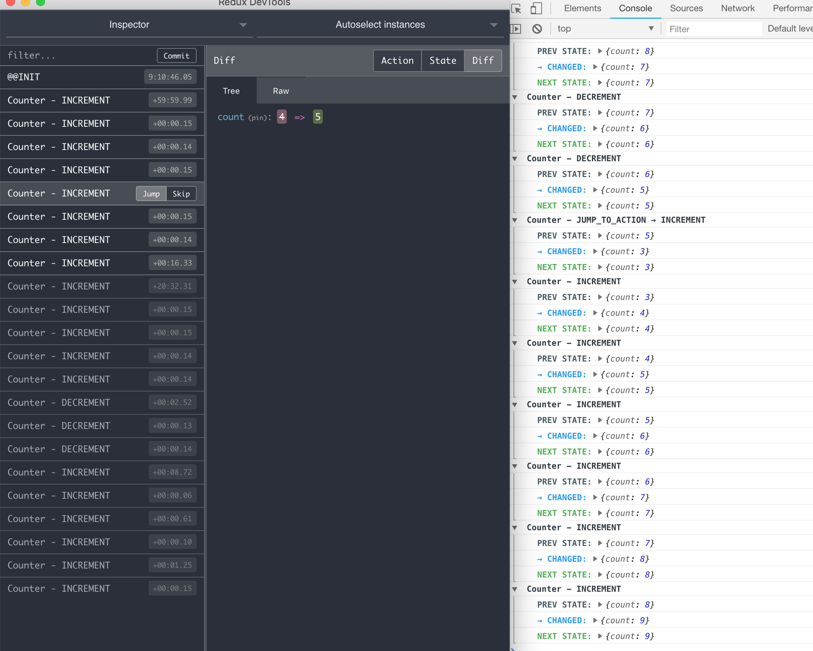

## Unstated logger

Debug your [unstated](https://github.com/jamiebuilds/unstated) containers easily with `unstated-logger` who adds support for redux dev tools. The integration with the `redux dev tools` plugin makes jumping from different state in time possible (time travel).

<br>

<br>

## Install

```bash
npm install --save unstated-logger

# or

yarn install --save unstated-logger
```

## Usage

In the root of your app, import unstated-logger`:

```js
import Logger from 'unstated-logger';

Logger.start();

// ... Yor component code as always
```


## Integration with redux dev tools

Install the browser plugin available in [redux dev tools](http://extension.remotedev.io/), follow the instructions and you are ready to go. This plugin makes jumping from different state in time possible (time travel).

Once the plugin is installed we need to communicate actions to it, the changes you need to do are in the `Container` classes. You must give an instance name and notify actions using the same payload for state changes.

In the example bellow we assign the **`Counter`** name for the redux dev tools widget and notify about `INCREMENT` and `DECREMENT` actions, using the reserved keyword `\_\_action, so we can track this in the redux dev tools panel using the web browser.

```js
// @flow
import { Container } from 'unstated';

type CounterState = {
  count: number
};

class CounterContainer extends Container<CounterState> {
  state = {
    count: 0
  };

  // Widget name to show in the redux devl tools panel
  name = 'Counter';

  increment() {
    this.setState({
      count: this.state.count + 1,
      __action: 'INCREMENT'
    });
  }

  decrement() {
    this.setState({
      count: this.state.count - 1,
      __action: 'DECREMENT'
    });
  }
}
```

## API

After logger get staterted it exposes some methods and config options so you can explore the containers or their states in the Dev Tools panel.

```js
// Get all the states in the store
const store = Logger.store();
// Do something with the store

// Get all containers
const containers = Logger.containers();
// Do something with the containers

// Output all the states
Logger.print();
```

The logger accepts the following config options:

## Config

```js
const config = {
  collapsed: true,
  detailed: false,
};

Logger.config(config);
```

#### collapsed
Type: `boolean`
<br>
Default: `false`

Collapse the state change logs in the Dev Tools console.

#### detailed
Type: `boolean`
<br>
Default: `true`

Log detailed state changes (Added, deleted and changed).

#### ignore
Type: `array`
<br>
Default: `['JUMP_TO_STATE', 'JUMP_TO_ACTION']`

Actions to be ignored in the redux Dev Tools notifications.

#### details
Type: `array`
<br>
Default: `['added', 'updated', 'deleted']`

The log level detail to show up in the Dev Tools console. Allowed values `added`, `updated` and `deleted`.